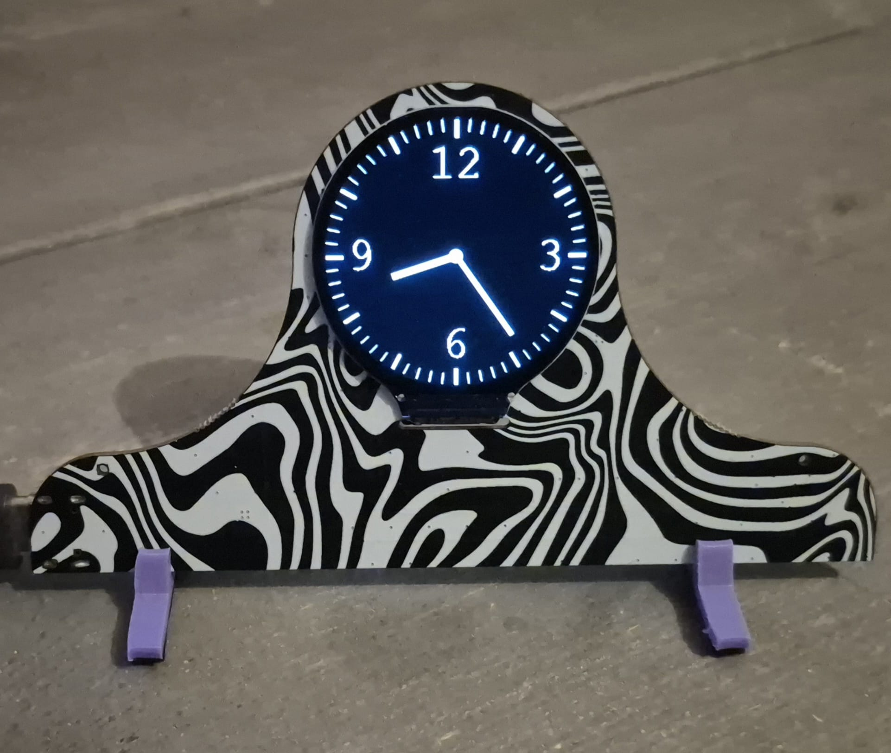

<p align="left">
  <a href="https://github.com/zephyrproject-rtos/zephyr">
    
  </a>
  <a href="https://www.altium.com/altium-designer">
    
  </a>
  <a href="">
    
  </a>
</p>

# Christmas Mantel Clock

Hardware and firmware for a my 2025 christmas present to friends and family. This repository describes the device I designed, which is built around an STM32 microcontroller running Zephyr RTOS with LVGL/EEZ Studio UI.



This repository is intended as a reference for the design, including electronics, firmware, and build configuration.

## Features

- Custom PCB and hardware design
- GC9A01 240x240 1.28" round LCD
- Zephyr RTOS board definition based on the PCB
- STM32F405-based firmware
- Zephyr RTOS configuration
- Windows-based build scripts

Designed as a standalone mantel clock, nice for on the mantel!

## Getting Started

### Prerequisites

- ARM GCC toolchain
- CMake 3.20 or newer
- Zephyr SDK and dependencies
- West Metatool
- Windows build environment (CMD or PowerShell)

### Build

From the repository root:

```bat
build.bat
```

To perform a clean (pristine) build:

```bat
build_pristine.bat
```

## Configuration

- `mantelclock_defconfig`
  Default configuration associated with the mantel clock board, enabling required drivers and functionality for bare-bones implementation
- `prj.conf`  
  Implementation-specific configuration

## Flashing and Debugging

1. Connect a supported debugger (ST-Link, J-Link, etc.). 
3. Flash the generated image to the target device (DFU or SWD).
4. Use a SWO-capable debugger for live SWO-trace logging and debugging

## Hardware

Hardware design files, including schematics and PCB layouts, are located under the `Hardware/` directory.
To replicate, simply use the supplied gerbers, -BOM and -CPL files and order the board (assembled) at JLCPCB.

Hardware designed using Altium Designer

## License

Apache License 2.0


